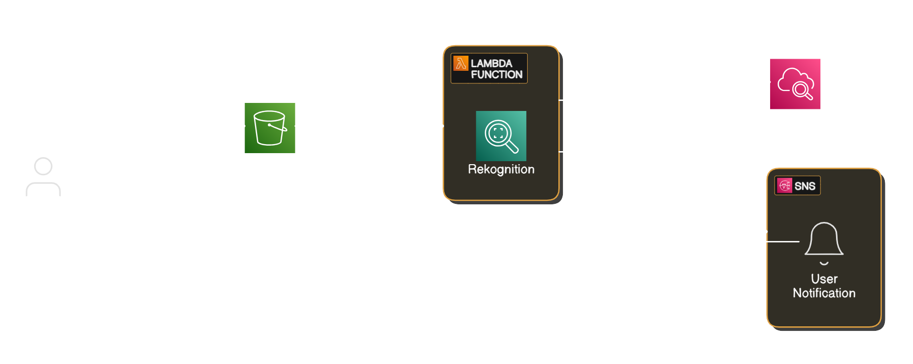

# AI Image Label Detector

### The goal is to create an AI image label detector that detects and labels objects in an image using AWS Rekognition.

# Tech Stacks
* AWS S3
* AWS Rekognition
* AWS Lambda (Python)
* AWS IAM
* Git & Github
* AWS SNS
* AWS CloudWatch

AWS CLI Commands Used 

## Lambda 
* Deploying Lambda Function
```bash
aws lambda create-function --function-name ai-image-label-detector --runtime python3.9 --role arn:aws:iam::<your-account-id>:role/<lambda-execution-role> --handler app.lambda_handler --zip-file fileb://function.zip
```
* Zip Lambda Function
```bash
Compress-Archive -Path app.py -DestinationPath function.zip
```
* Updating Lambda Code
```bash
aws lambda update-function-code --function-name ai-image-label-detector --zip-file fileb://function.zip
```

## SNS
* Creating Topic
```bash
aws sns create-topic --name ai-image-label-notifier
```
* Subscribing to Email
```bash
aws sns subscribe --topic-arn arn:aws:sns:us-east-1:<your-account-id>:ai-image-label-notifier --protocol email --notification-endpoint your-email@example.com
```

# IAM Policy Attached
* AmazonRekognitionFullAccess
* AmazonSNSFullAccess
* AmazonS3ReadOnlyAccess


# Testing the System
* Confirm your email subscription to the SNS topic.
* Upload an image to your S3 bucket
* Check your email inbox for a label detection message.
* Use CloudWatch to debug logs if needed.

# Architecture

* This is image shows the workflow for the detecting images.

